<div align="center">

# Claude Office

**Your Claude Code sessions, as a cosy little 3D office. You're the manager.**

[](package.json)
[](#quick-start)
[](https://threejs.org)
[](https://claude.com/claude-code)

[Quick start](#quick-start) · [What you'll see](#what-youll-see) · [Features](#features) · [Controls](#controls) · [How it works](#how-it-works) · [Roadmap](#roadmap)

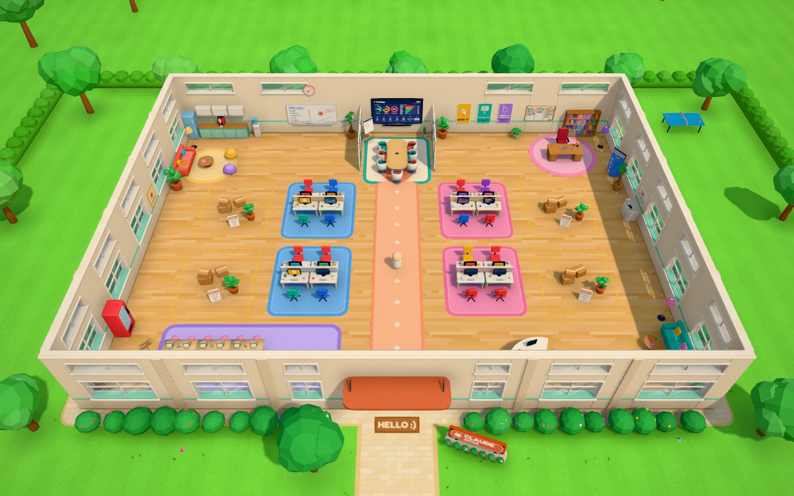

</div>

Every Claude Code session running on your machine is an employee at a desk. New
sessions walk in the front door and sit down. Sessions that need your permission
raise their hand. Sessions that finish go home. You walk around in third person,
check on people, hire new ones, call old ones back in, and sit down at their
computer to talk to them through the real Claude Code terminal.

It's Claude Code, but fun.

## Quick start

```bash
git clone https://github.com/duysqubix/claude-office && cd claude-office
npm install
npm start          # builds, serves http://127.0.0.1:4777 and opens your browser
```

Every Claude Code session already running on your machine walks into the office. The
office only **reads** Claude Code's own files and changes nothing in your Claude setup.
The café music starts after your first click or key press (browsers keep a page quiet
until then); `M` mutes it.

**Requirements:** macOS, Linux or Windows ([with WSL2](#windows-wsl2)), Node 22+, Claude
Code (`claude`) on your PATH, and `tmux` if you want to hire, resume or let go of sessions
from inside the game, or use the Shell tab and hot desks.

### Windows (WSL2)

Run the office inside [WSL2](https://learn.microsoft.com/windows/wsl/install), in the same
distro as Claude Code. It's then the Linux setup: install Node 22+, `tmux` and Claude Code
in WSL and run the three commands above.

- **Open it in your Windows browser.** WSL2 forwards `localhost` to Windows, so
  `http://127.0.0.1:4777` works there. If `npm start` doesn't open it for you, paste the
  address into your browser.
- **Only sessions running in WSL join.** The office reads `~/.claude` in your WSL home.
  Claude Code running natively on Windows (PowerShell or CMD) keeps its sessions in your
  Windows home, so those don't appear.
- **Choppy on a laptop with two GPUs?** Windows often runs the browser on the
  power-saving integrated GPU. In **Settings → System → Display → Graphics**, set your
  browser to **High performance**, then quit the browser completely (every window) and
  reopen it. Task Manager's **GPU engine** column shows which GPU it's using.

## What you'll see

| In Claude Code | In the office |
| --- | --- |
| A running session | An employee at a desk |
| Session is busy | Typing away (reading, running commands, browsing, thinking…) |
| Permission prompt / question / dialog | Hand up, big **!** over their head |
| Finished its turn | Leans back, waits for you |
| Idle for 15+ minutes | Asleep on the keyboard |
| Subagents | Interns at the intern bench |
| `claude` (new session) | **Hire** someone at reception |
| `claude --resume` | **Call someone back in** from the Personnel Files |
| Typing into the session | Sit at their computer (real terminal, in-game) |
| A shell of your own | Any empty desk: sit down and it's your terminal (a hot desk) |
| `/exit` | Pack up and walk out |
| Thinking about the work | Now and then, a thought bubble about what they're really doing |

<table>
  <tr>
    <td width="33%">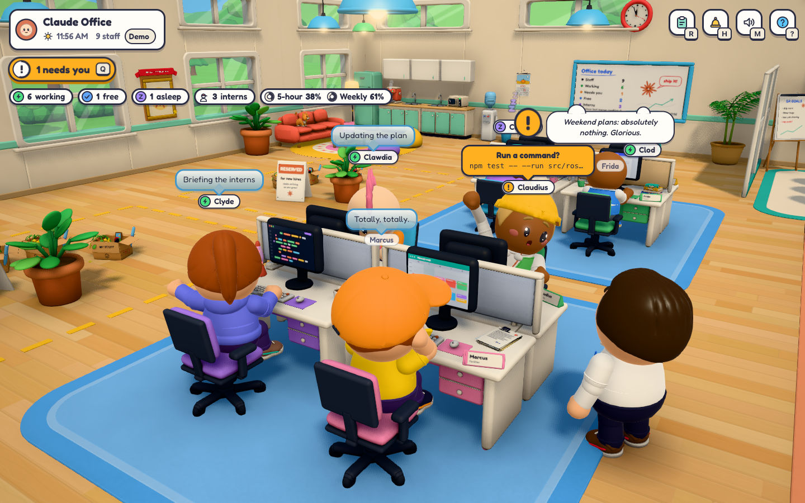</td>
    <td width="33%">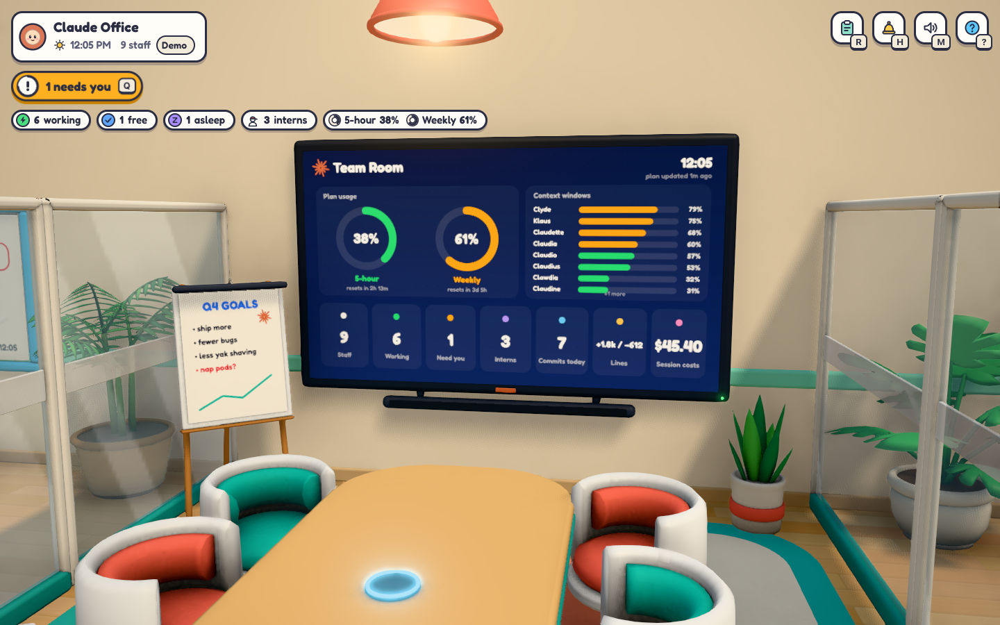</td>
    <td width="33%">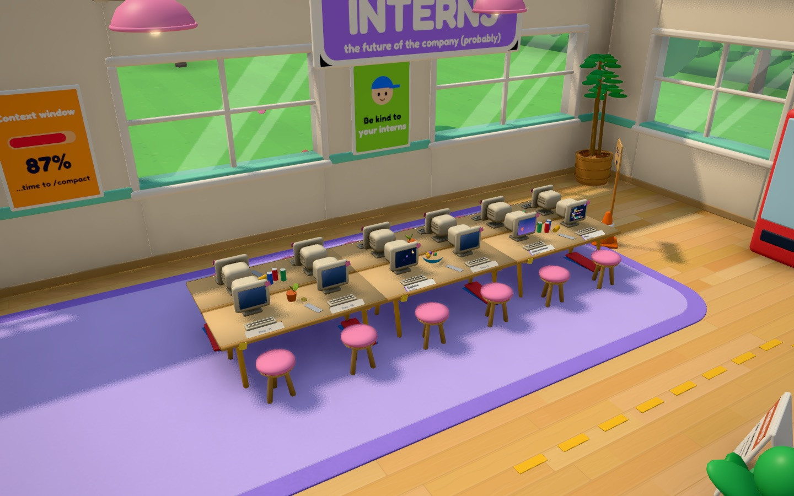</td>
  </tr>
  <tr>
    <td align="center"><sub>Desk pods. An orange screen means that employee needs you.</sub></td>
    <td align="center"><sub>The Team Room board: plan usage, context windows, headcount, commits and session costs.</sub></td>
    <td align="center"><sub>Subagents sit at the intern bench.</sub></td>
  </tr>
</table>

Art direction: chunky, sunny and toy-like. Round heads, stubby limbs, springy movement
that trails a beat behind the controls, bright colours, soft shadows.

## Features

- **Answer without the terminal.** With the optional hooks, permission prompts, questions
  and plan approvals appear in the game: Allow, Deny, or pick an option.
- **Sit at their computer.** Sessions you hire run in `tmux`, and sitting down attaches the
  real terminal (xterm.js) in-game. Every computer has a second tab, **Shell**: a shell in
  that employee's folder, next to Claude (`` Ctrl+` `` switches).
- **Hot desks.** Walk up to any empty desk and press `E` to use its computer: your own shell,
  in your home folder. It keeps running after you stand up, so a long command keeps going,
  and the desk says "Hot desk" until you shut it down.
- **Chat with any employee.** Their replies render as real markdown (tables, highlighted
  code with Copy), tool steps show as they happen ("Editing `auth.ts`"), and you can send a
  message or interrupt a hosted session. A session you started in your own terminal can be
  adopted: when it exits there, the office resumes it with the whole conversation.
- **Quick terminal.** Press `T` near anyone to see their live terminal at once, Claude and
  Shell tabs included, without walking over and sitting down.
- **Interns.** Subagents walk in, sit at the intern bench, and go home 5 minutes after they
  go idle.
- **Team Room.** A wall screen with your 5-hour and weekly plan usage, every employee's
  context window, and who's working or waiting.
- **Triage in one key.** `Q` walks you to whoever has waited longest.
- **A lively office.** NPC regulars fill free desks, take coffee breaks and chat, and give a
  desk up to a real session when the room is full ("All yours!"). Mabel runs the front desk.
  None of them are Claude sessions; real sessions wear the orange lanyard. Everyone steps
  around everyone else ("Sorry!", "After you!"), lava lamps bubble on the desks, and out back
  a stepping-stone trail with rose arches winds through the garden past loungers, a hammock,
  a picnic table and the pond, with lights that come on at dusk and people on their break.
- **Music and sounds.** Coffee-shop music made up as it plays (softer after 9 pm, a little
  quieter while you type to someone) and small interface sounds. Help → Music and sound has
  the volumes; `M` mutes everything.
- **Your Spotify on the office speakers.** Press `E` at the laptop on the boss desk: Liked
  Songs and your playlists, with play, pause, skip and seek. While it plays, the café band
  steps aside and the laptop's screen shows the song from across the room. Needs Premium and
  your own Spotify app ([setup](#spotify)).
- **Thought bubbles.** Now and then a working session thinks one short line about what it's
  really doing (written by Haiku on your Claude login, at most 20 an hour, only while you're
  watching); regulars daydream. Turn them off in Help.
- **First person.** `V` puts you behind your own eyes, mug in hand.
- **First-run tips.** A few small cards teach the basics on your first visit.

<table>
  <tr>
    <td width="50%">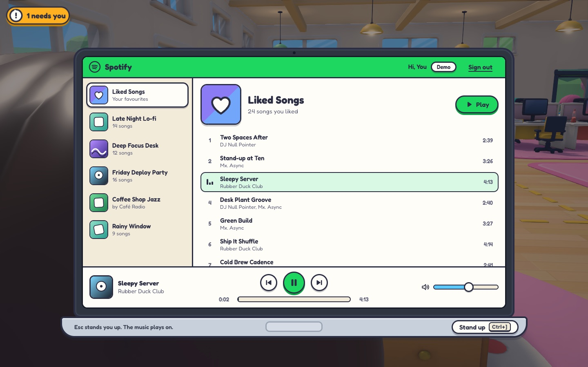</td>
    <td width="50%">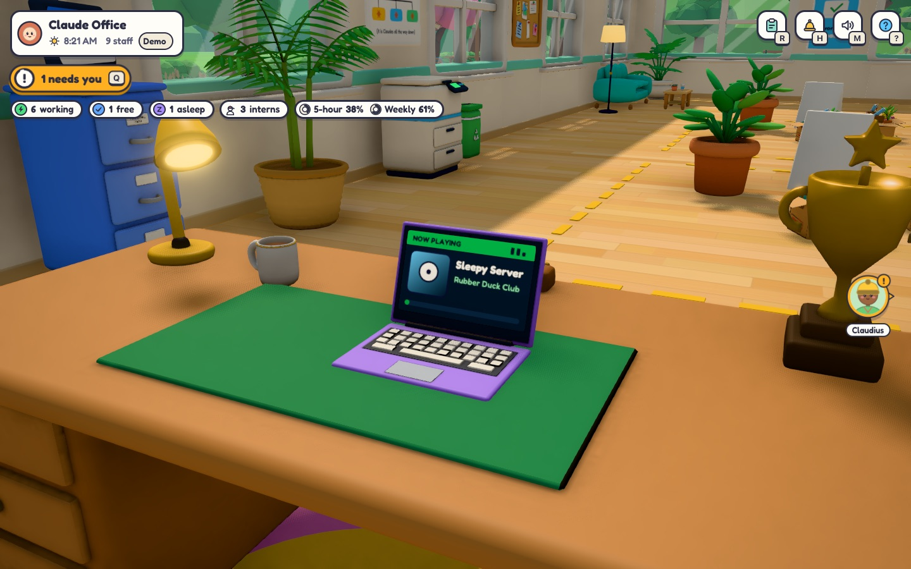</td>
  </tr>
  <tr>
    <td align="center"><sub>Your Spotify on the manager's laptop.</sub></td>
    <td align="center"><sub>Now playing, on the laptop's own screen.</sub></td>
  </tr>
  <tr>
    <td width="50%">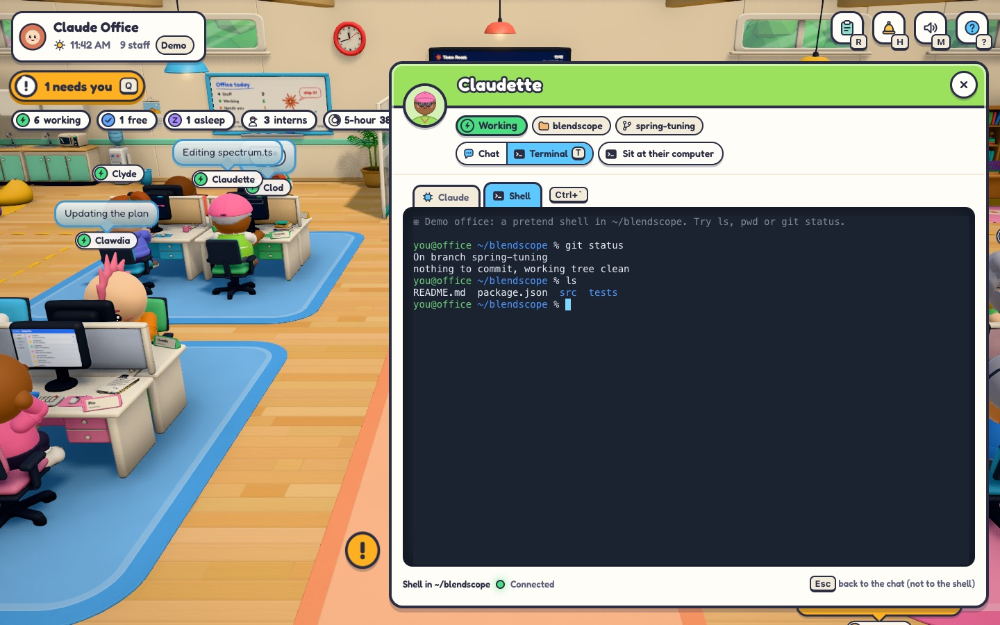</td>
    <td width="50%">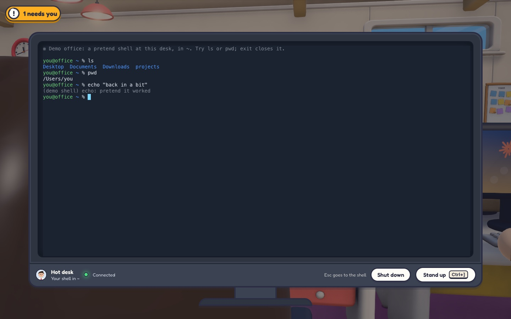</td>
  </tr>
  <tr>
    <td align="center"><sub>Claude | Shell: a shell in their folder, right next to Claude.</sub></td>
    <td align="center"><sub>A hot desk: any empty desk is your terminal.</sub></td>
  </tr>
  <tr>
    <td width="50%">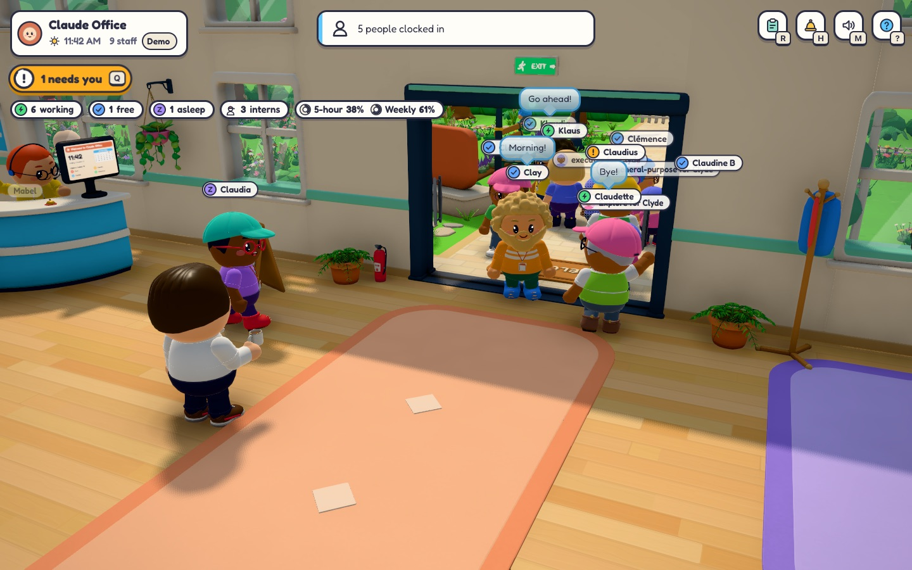</td>
    <td width="50%">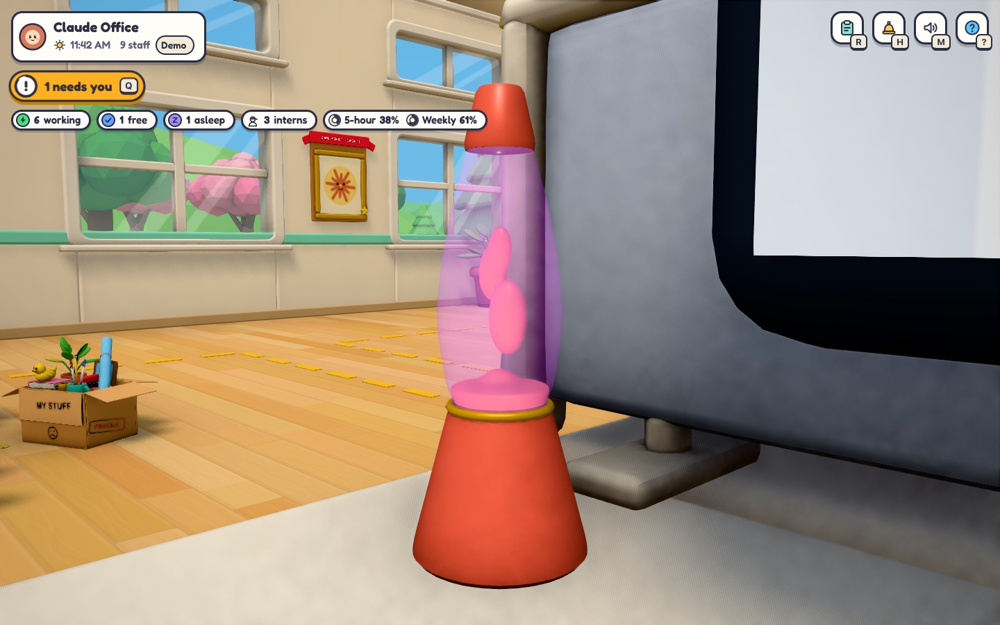</td>
  </tr>
  <tr>
    <td align="center"><sub>Five clock in, five go home, and everyone gives way.</sub></td>
    <td align="center"><sub>Lava lamps with real moving wax.</sub></td>
  </tr>
  <tr>
    <td width="50%">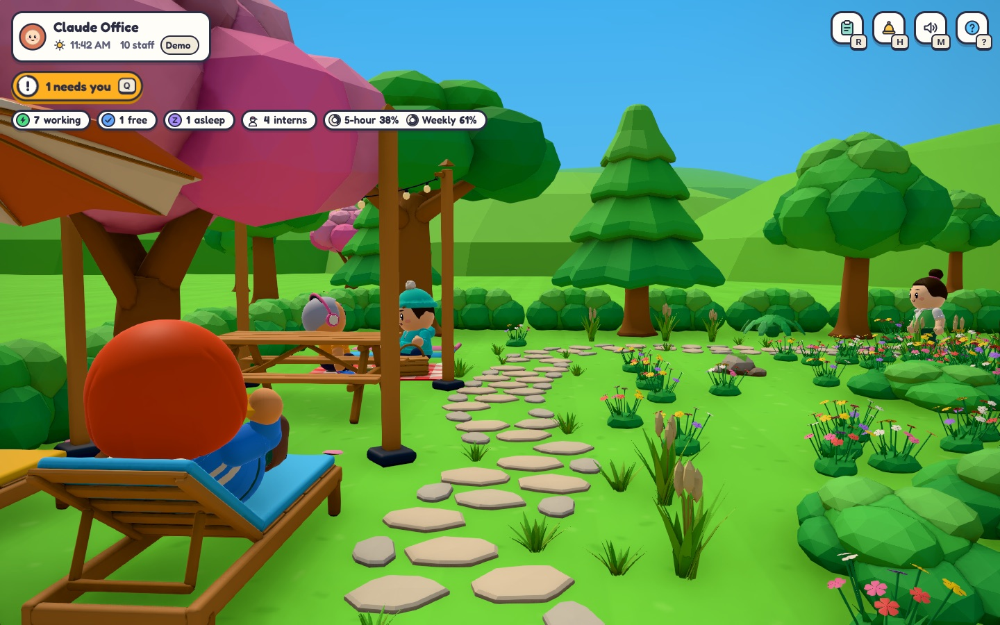</td>
    <td width="50%">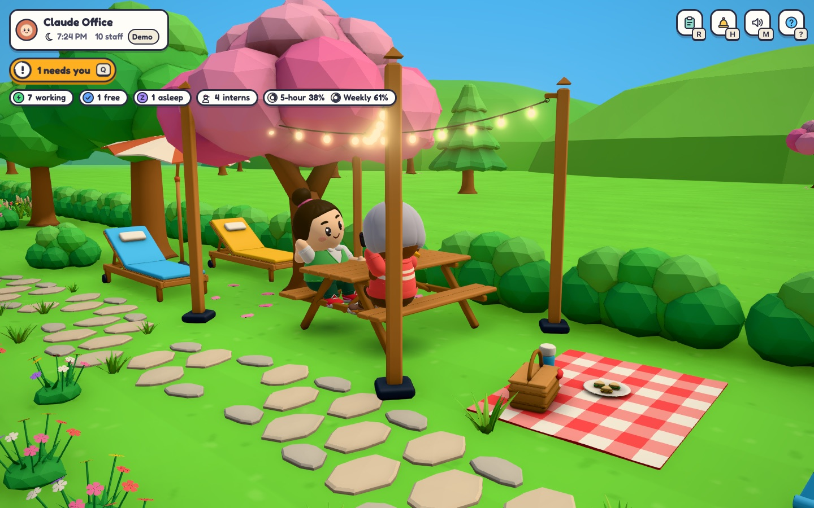</td>
  </tr>
  <tr>
    <td align="center"><sub>Out back: a stepping-stone trail and people on their break.</sub></td>
    <td align="center"><sub>The picnic table when the lights come on.</sub></td>
  </tr>
</table>

<p align="center">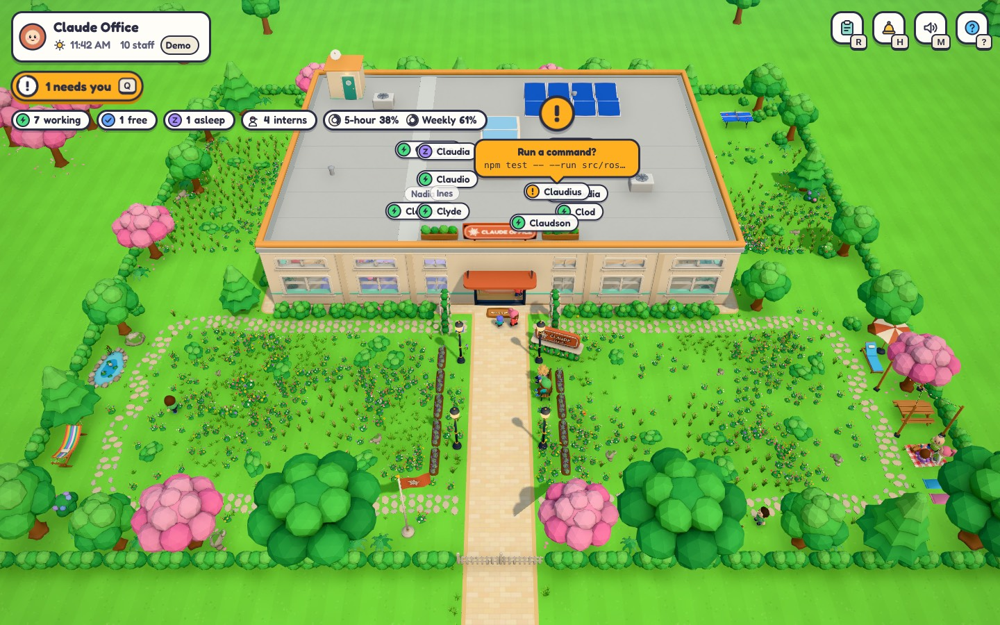</p>

<p align="center">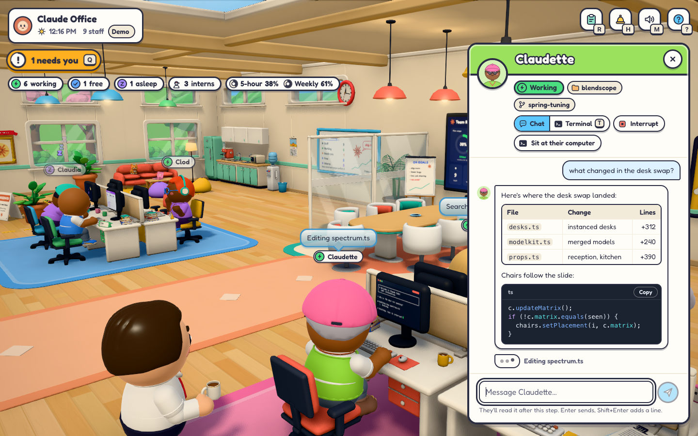</p>

## Optional extras

| Want | Do | Undo |
| --- | --- | --- |
| Answer permission prompts, questions and plan approvals **in the game** (Allow / Deny / pick an option) | `npm run hooks:install` | `npm run hooks:uninstall` |
| Plan-usage gauges (5-hour / weekly) on the Team Room board, if you don't use oh-my-claudecode's HUD | `npm run statusline:install` (wraps your current status line, which keeps working) | `npm run statusline:uninstall` |
| Play your Spotify on the office speakers | Make your own Spotify app ([below](#spotify)), then press `E` at the laptop on the boss desk | **Sign out** on the laptop |
| Develop the client with hot reload | `npm run dev` | |

With the hooks installed, the office only steps in while you're looking at it (visible
tab, recent input). After 90 s, or when the office is closed, the question goes back to
the normal terminal prompt. Each change to `~/.claude/settings.json` is backed up.

### Spotify

The laptop walks you through this the first time. It takes a couple of minutes, once, and
playing music needs Spotify Premium.

1. At [developer.spotify.com/dashboard](https://developer.spotify.com/dashboard), create an
   app (any name).
2. Add the redirect URI `http://127.0.0.1:4777/callback` (your office's port; the laptop shows
   the exact address). It must be `127.0.0.1`: Spotify refuses `localhost`.
3. Tick **Web API** and **Web Playback SDK**, then save.
4. Paste the app's **Client ID** into the laptop and press **Sign in with Spotify**.

Your sign-in stays on the server in `~/.claude-office/spotify-<port>.json`, readable only by
you. Each office has its own.

## Controls

| Key | Action |
| --- | --- |
| `WASD` / arrows | Walk (relative to the camera) |
| `Shift` | Run |
| `Space` | Jump |
| `V` | First / third person |
| Mouse drag / wheel | Orbit / zoom the camera (scroll all the way in for first person) |
| `E` | Interact (employee, reception, filing cabinet, whiteboard, coffee); chat with someone |
| `E` at an empty desk | Hot desk: use its computer, your own shell (`Esc` goes to the shell) |
| `E` at the boss desk | Your laptop: Spotify on the office speakers (`Space` plays and pauses) |
| `T` | Quick look at someone's live terminal (`Esc` goes back) |
| `R` | Roster |
| `Q` | Walk to whoever needs you (longest wait first) |
| `H` | Hire |
| `M` | Mute (music and sounds) |
| `` Ctrl+` `` | At a computer: switch between Claude and Shell |
| `Ctrl+]` | Stand up from a computer |

## How it works

```
~/.claude/sessions/<pid>.json ─┐   live sessions + status (busy / idle / waiting)
~/.claude/projects/**.jsonl ───┼─► server/ (Node, 127.0.0.1:4777) ──ws──► client/ (Three.js)
~/.claude/projects/*/<id>/subagents ┘        │
                                             └─ tmux ─► sessions you hire in-game
```

- **Who's in the office.** Claude Code keeps a registry of live sessions in
  `~/.claude/sessions/<pid>.json` (pid, session id, cwd, name, status). The server
  polls it and checks each pid is still a running `claude`.
- **What they're doing.** The server tails each session's transcript
  (`~/.claude/projects/<project>/<session>.jsonl`) for the current tool, last message,
  title, branch and cost, and reads `subagents/*.meta.json` for interns.
- **Hiring.** New sessions start inside `tmux` (`office-<id>`), so they survive a
  server restart and you can also `tmux attach -t office-<id>` from any terminal.
  In-game, "sit at their computer" attaches an xterm.js terminal to that tmux session.
- **Sessions you started yourself** in a normal terminal show up too. You can see what
  they're doing and what they said; to type into them, adopt them or use their own terminal.

Nothing is installed into your Claude Code config unless you opt into the hooks above.

## The models

The office is built from 253 chunky `.glb` models in `client/public/models`. Four AI
artist sessions (Claude Monet, Cézanne, Lorrain and Rodin) made them in Blender from
the build scripts in `assets/blender/`. You don't need Blender to run the office. See
[docs/ASSETS.md](docs/ASSETS.md) to remake a model or add one, and run `npm run catalog`
to browse them all at `http://127.0.0.1:4777/catalog.html`.

## Development

| Command | What it does |
| --- | --- |
| `npm run dev` | Server with hot reload |
| `npm run typecheck` | Type-check the client (`npm run typecheck:server` for the server) |
| `PORT=4778 npm run smoke` | Smoke test of a running dev office. It opens and closes real shells, so it refuses your own game (4777) |
| `npm run catalog` | Rebuild the model catalog from the GLBs |

## Safety

The server binds to `127.0.0.1` only and rejects requests whose `Host` or `Origin`
isn't the office itself, because it can start Claude sessions and type into them. Other
sites can't frame it (`X-Frame-Options: DENY`), the production build only runs its own
scripts, and everything a session writes is shown as text, never HTML. In-game answers
need a deliberate click or key on the question itself. Thought-bubble calls run with no
tools, no settings and no file attachments. An office only drives the tmux sessions it
started itself: a second copy of the office never types into, attaches to or closes yours.
Spotify's player script never runs in the office page: it runs in its own frame on a
separate local port that the office refuses, and only once you've signed in and opened the
laptop.

## Roadmap

See [docs/SPEC.md](docs/SPEC.md) for the full design and [docs/GAMEPLAY.md](docs/GAMEPLAY.md)
for the game layer. Next up:

- Hire with a role (agent type / model / effort)
- A cosmetic shop: earn Beans for finished turns, commits and merged PRs, spend them on hats
  and decor
